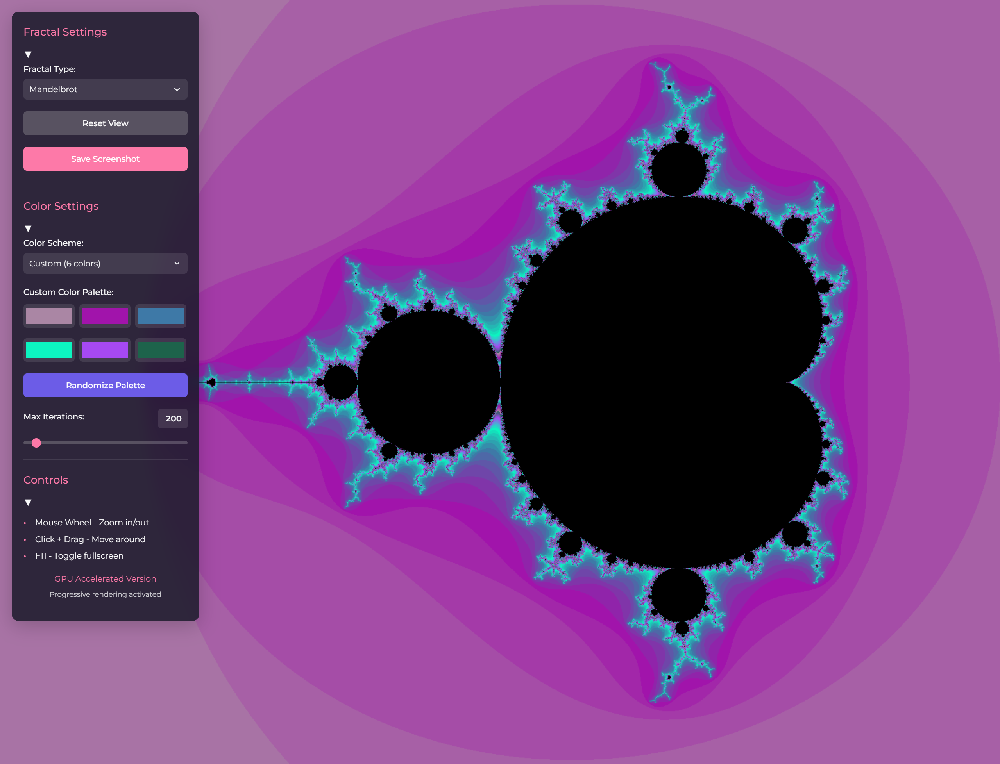

# Fractal Explorer

Fractal Explorer is a web application that allows interactive exploration of various fractals, including the Mandelbrot set, Julia set, Sierpiński triangle, Koch snowflake, Barnsley's fern, and fractal tree. The application provides a variety of controls to adjust fractal parameters, such as deep iterations, color schemes, and recursion depth.

## Features

- **Mandelbrot Set:**  
  Explore the classic Mandelbrot fractal with the ability to zoom in and set the number of iterations.

- **Julia Set:**  
  Choose from predefined complex parameters and visualize different Julia sets.

- **Sierpiński Triangle:**  
  Generate the Sierpiński triangle using the Chaos Game method with customizable colors.

- **Koch Snowflake:**  
  Create a Koch snowflake with adjustable recursion depth for varying levels of detail.

- **Barnsley's Fern:**  
  Visualize Barnsley's fern using an Iterated Function System (IFS) with interactive color customization.

- **Fractal Tree:**  
  Generate fractal trees with adjustable recursion depth to modify branch complexity.

- **Color Schemes:**  
  Choose from preset color schemes (grayscale, rainbow, blue, fire) or create your own scheme by selecting up to 6 colors.

- **Responsive Design:**  
  The application adapts to various screen sizes and supports fullscreen mode.

- **Save Screenshot:**  
  Save the current view of the fractal as a PNG file.

### Using the "Color Scheme" Dropdown

- **Grayscale**
- **Rainbow**
- **Blue**
- **Fire**
- **Custom**

When **"Custom"** is selected, color inputs appear for setting up to six colors. Choose colors according to your preference and the fractal will update immediately.

### Interactive Controls

- **Zooming:**  
  Use the mouse wheel to zoom in or out of the fractal. During zooming, the number of iterations automatically increases to maintain detail.

- **Panning:**  
  Click and drag the mouse to move around the fractal.

### Fullscreen Mode

- **Fullscreen Mode:**  
  Press F11 to toggle fullscreen mode. Pressing F11 again will exit fullscreen mode.

## Contributing

Contributors are welcome! If you have ideas for improvements or find a bug, feel free to create an issue or send a pull request.

## License

This project is licensed under the MIT License.

## Author

**Ing. Robert Polák**
